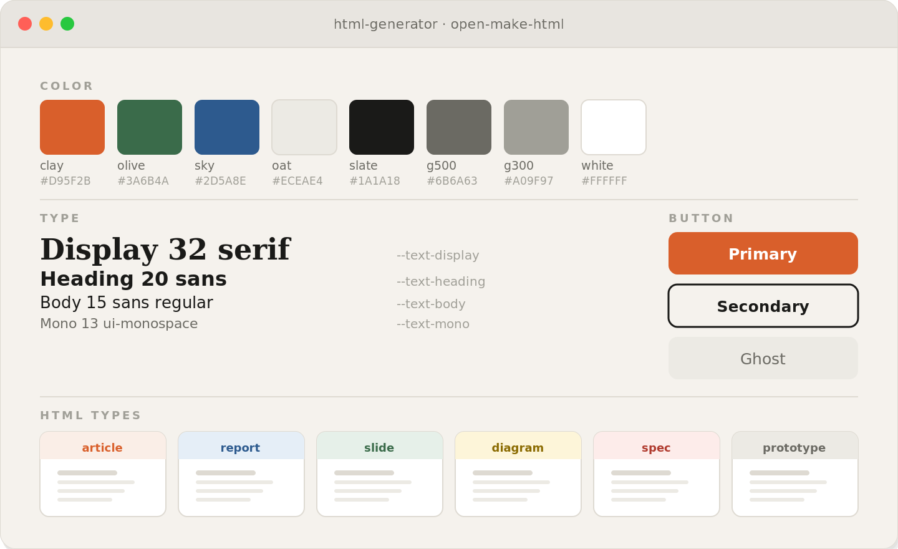

# HTML Generator Skill



AI가 HTML 파일을 생성하고, 선택적으로 GitHub Actions로 자동 배포까지 설정해주는 스킬입니다.

## 무엇을 할 수 있나요?

- 아티클, 리포트, 슬라이드, 다이어그램, 명세서, 코드 리뷰, 인터랙티브 도구 등 **12가지 타입의 HTML** 생성
- 생성 후 **GitHub Actions + GitHub Pages 자동 배포** 설정 여부를 선택
- 한 번 설정하면 이후 HTML 파일을 푸시할 때마다 자동으로 웹에 발행

---

## AI에게 설치 요청하는 방법

### Claude Code (터미널/IDE) — 자동 설치

아래 한 줄을 Claude Code에 전달하면 자동으로 설치됩니다.

```
https://github.com/imuzikr/open-make-html 스킬을 설치해줘
```

Claude Code가 이 README를 읽고 `claude-code/html.md`를 `.claude/commands/html.md`에 자동으로 복사합니다.

설치 후 사용법:
```
/html article 온톨로지란 무엇인가
/html slide 분산 시스템 입문
/html report Q2 인프라 인시던트
```

---

### claude.ai (웹) — zip 파일로 설치 (권장)

**1단계: zip 다운로드**

이 페이지 상단의 `Code` 버튼 → `Download ZIP` 클릭

**2단계: claude.ai 대화창에 업로드 후 아래 문장 전송**

```
첨부한 zip 파일 안의 claude-ai/SKILL.md 내용을 읽고
claude.ai 스킬 등록 방법을 단계별로 안내해줘
```

Claude가 zip 안의 SKILL.md를 읽고 등록 절차를 안내해 줍니다.

**직접 등록하려면:**

1. [claude.ai/customize/skills](https://claude.ai/customize/skills) 접속 → `+` 버튼 클릭
2. **이름**: `html-generator`
3. **설명**:
   ```
   HTML 파일을 만들어줘, 아티클 만들어줘, 슬라이드 만들어줘, 다이어그램 그려줘,
   리포트 써줘, 정리해서 HTML로 등 HTML 생성이 필요한 모든 요청에 사용.
   생성 후 GitHub Actions 자동 배포 설정 여부를 물어봄.
   ```
4. **내용**: [`claude-ai/SKILL.md`](https://github.com/imuzikr/open-make-html/blob/main/claude-ai/SKILL.md) 전체 내용 붙여넣기

---

### ChatGPT / Gemini / 기타 AI — 대화에 직접 적용

아래 문장을 대화창에 입력하면 스킬 내용이 현재 대화에 바로 적용됩니다.

```
https://github.com/imuzikr/open-make-html 의 universal/instructions.md 내용을
읽고 지금 대화에 적용해줘
```

---

## 파일 구조 설명

| 파일 | 용도 |
|---|---|
| `claude-code/html.md` | Claude Code 슬래시 커맨드 (`/html`) |
| `claude-ai/SKILL.md` | claude.ai Skills UI 등록용 |
| `claude-ai/references/implementation-templates.md` | CSS/JS 구현 템플릿 7종 |
| `claude-ai/references/github-actions-guide.md` | GitHub Actions 설정 안내 |
| `universal/instructions.md` | 다른 AI 서비스용 지시문 |
| `github-actions/deploy.yml` | GitHub Actions 워크플로 파일 |
| `github-actions/generate_index.py` | 자동 목차 생성 스크립트 |

---

## GitHub Actions 자동 배포란?

HTML 파일을 main 브랜치에 푸시하면:

```
git push
    ↓
GitHub Actions 실행
    ↓
목차(index.html) 자동 재생성
    ↓
GitHub Pages 자동 배포
    ↓
웹에서 바로 확인 가능
```

스킬 사용 중 AI가 "GitHub Actions로 자동 배포를 설정할까요?" 라고 물어보면
"응" 또는 "yes"라고 답하면 설정 방법을 단계별로 안내해 줍니다.

---

## 라이선스

MIT — 자유롭게 사용, 수정, 공유 가능합니다.
